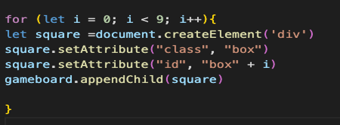
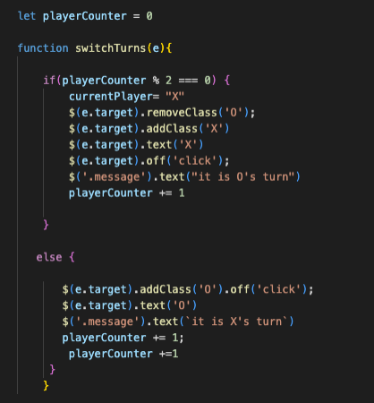
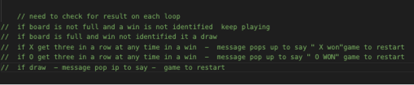
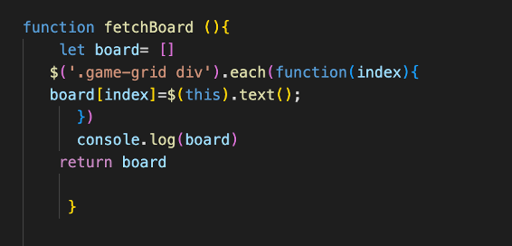
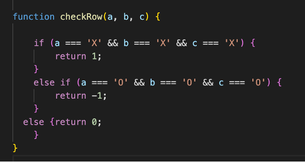
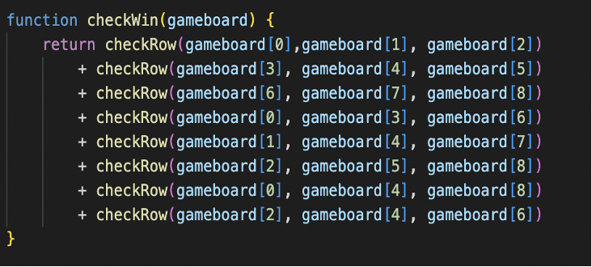
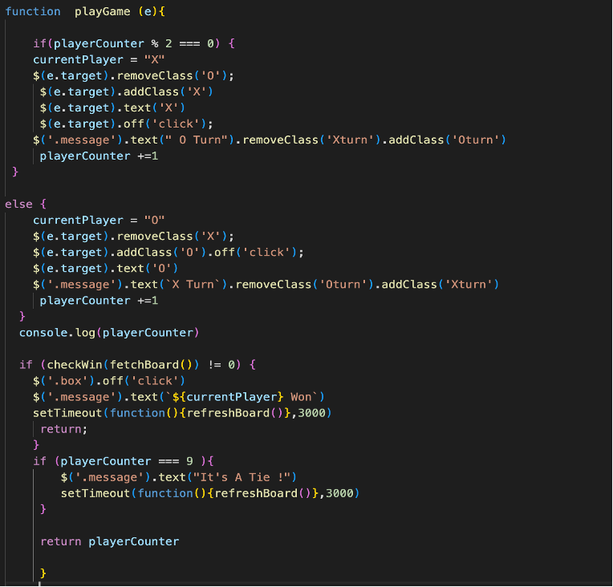

## **Project 1: Tic Tac Toe** 
---

### **Contents** 
 
* [Overview](#overview)
* [The Brief & Timeframe](#the-brief--timeframe)
* [Technologies used](#technologies-used)
* [The Planning & Development Process](#the-planning--development-process)
* [Wins & Challenges](#wins--challenges)
* [Known Bugs](#known-bugs)
* [Future Enhancements](#future-enhancements) 
* [Key Learnings](#key-learnings)

 

### **Overview**
---

Tic Tac Toe is a game whereby if you get three X’s or O’s in a row you win.  This was my first project and my first ever attempt a building an online line, so I chose to go with what would be considered the ‘beginner-friendly’ two-player version of the game to help consolidate my learning from the first two weeks of the software engineering immersive course.

The source code can be found on GitHub [here](https://github.com/HelenevB/SEI-Project01-Tic-Tac-Toe)

If you want to try playing the game, you can access the deployed version [here](https://pages.git.generalassemb.ly/hvb/Project-One-Tic-Tac-Toe/) 

 

### **The Brief & Timeframe**
---

* Build a dynamic game that allows two players to compete from the same computer
* The game must be able to determine a winner
* The game must be fully responsive 
* This was a solo project 
* Timeframe: 7 days 
 

### **Technologies used** 
---

* Html5
* CSS3
* JavaScript
* jQuery

 

### **The Planning & Development Process**
---

I spent the initial stages of the process sketching out the design for the game and writing out the logic for the game.

   

To help manage the build I broke down the development process into 4 sections;

* Start function & Game setup
* Playing the game
* Determining the winner
* Restarting the game 

As part of the game set-up, I needed to create the grid that Tic-Tac-Toe would be played on, so one of the first tasks I set myself was to build the grid, I originally did this in HTML and CSS using a grid template, but reviewed this further down the line, considering my aim was to really consolidate my understand of JavaScript decided to minimise my use of HTML proceed with a JavaScript for loop instead: 

 
 

Once I had the board created, my first step was to  get the X and O’s to appear on click and establish the switch of turns between X & O, 

I started off with a function that I named “switchTurns”(later renamed playGame).  To make this work I stated a global variable called “playerCounter” and set it to 0. within the function I set a condition that after each click the player count would go up by one.  If the player count was even, it would be X and clicking the class X would be assigned which would render an X and if it was odd, it would be O’s go. Finally, to ensure the box could not be overwritten I disabled the click so the box could not be overwritten, I used JQuery. off() method to remove the event handler for the targeted box 

 

At this stage, I was feeling like I was making progress, I had a grid and on click of each box, an X ad O would appear alternatively. Now it was time to apply some logic to the game, I wrote this out in pseudocode first to help me breakdown my approach:

 

To determine the state of play I need to create functions that check the win.  I had three functions in all:

1. fetchBoards (), this took the value X & O from the board and placed them in an array at the given index. 

 

2. checkRow (), this function takes 3 parameters as an argument that would be checked against the conditions stated to establish if there was a winning combination and return a value based on whether it was X, O or null.

 

3. checkWin(), this function would take one parameter as an argument which I named “gameboard”. And then within the function checkRow() is called back 8 times, mapping over all possible winning combinations from the gameboard, to see if  the checkrow conditions are met.

 

With all the pieces of the puzzle  laid out I need to fit them together to complete the game logic, this is where my inexperience showed as I was struggling to visualize how it would look, from my pseudocode I knew I needed to check for the win at the end of each turn, so knew I’d have to callback the checkWin() function within switchTurns() but wasn’t sure how, so at this stage, I decided to consult with our lecturer as I find talking through my process helps me navigate towards the answer I am looking for : 

After consultation, I established that I need to add two if statements at the end of my switchTurns ()  function.  The first if statement checks for the win. The If statement takes checkWin () (with fetch boards as paramenter), as it conditional argument, stating if it does not return a value of 0, than a player has won (this would either be -1= O. or  1=X)

To determine which player won, I stated a global variable called “currentPlayer” on the start of each go the currentPlayer value would then either be set to X or O, on checking for the win if the condition were met I instructed the computer to display the message that would display that this                   “currentPlayer” had won.
.
If there was no win stated, I needed the second if statement to determine if there was a draw.  A draw would only be possible if all boxes were full, so I used the playerCounter as the conditional argument stating if it was equal to 9 to end the game and announce a tie.

 The completed code for the game-play logic now looked as below, this is the stage where it made sense to me to change the function name from switchTurns to playGame

 

The game was now playable, however as I had spent a lot of the week on the game functionality, I had limited time to add all the planned features and explore styling. With the time I had, I decided to keep it simple with a basic colour theme to add a small bit of personality (i do love a block colour combo)!
 

### **Wins & Challenges**
---

The biggest win for me was meeting the required MVP. 2 weeks prior I had never developed let own deployed an application so to see the a visual of the skills I had learnt was very rewarding.

The biggest challenge was the JavaScript logic, many times throughout the build process I felt like I had the pieces of the puzzle but was struggling to make them all fit. Whilst I was keen to independently work through the task, I knew when in the process to ask for help to talk through the hurdles, allowing me to enhance my understanding and move through the task to meet the MVP.   
 

### Known Bugs 
---
* The winners’ message is displayed in the opposite player’s colours
* The restart button is redundant 

 

### **Future Enhancements** 
---
* Player name and character selection 
* The player who wins starts the next round
* Score count to be included 
* Build a working restart functionality i.e score count goes back to zero and the game fully restarts 
* Enhance styling i.e hover effect etc 
 

### **Key Learnings**
---
My key takeaway from project one was understanding how important the planning process was and mapping out what the crucial functions would be, as throughout the week I was chopping and changing each function. I feel if I'd been more thorough with the planning process it would have been easier for me to stay on task!

