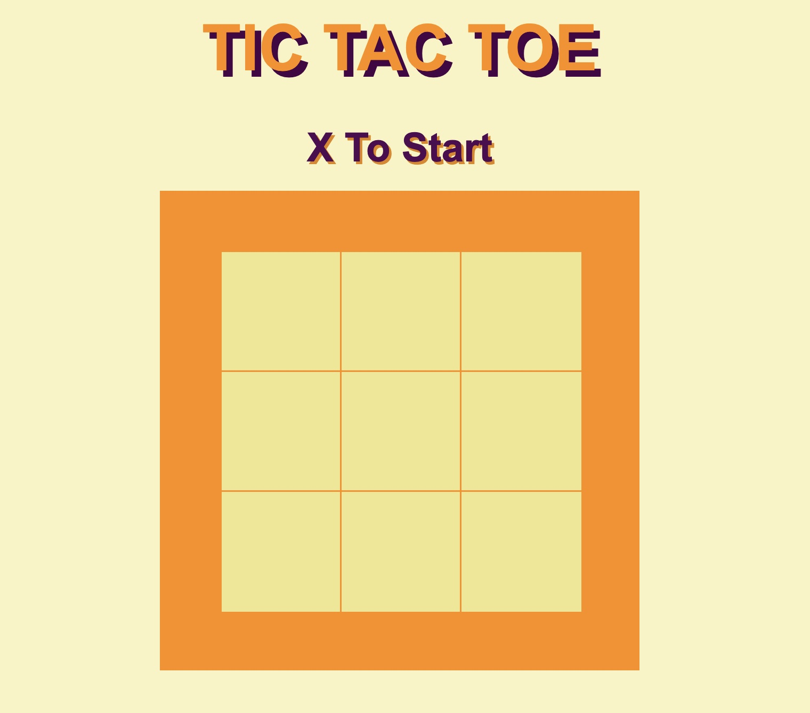
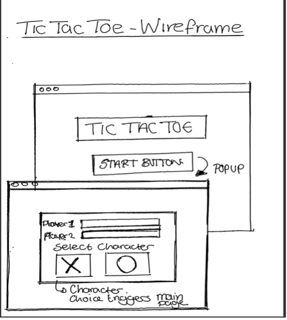
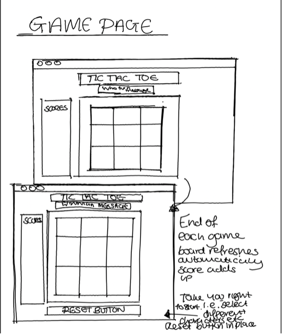

### General Assembly, Software Immersive Engineering Course – Project 1: Tic Tac Toe 
-------

### Contents 
 
* Overview 
* The Brief & Timeframe 
* Technologies used 
* The Planning & Development Process 
* Wins & Challenges
* Bugs
* Future Enhancements 
* Key Learnings

#### Overview
---

> Tic Tac Toe is a game whereby if you get three X’s or O’s in a row you win.  This was my first project and my first ever attempt a building an online line, so I chose to go with what would be considered the ‘beginner-friendly’ two-player version of the game to help consolidate my learning from the first two weeks of the software engineering immersive course.

> The source code can be found on GitHub [here](https://github.com/HelenevB/SEI-Project01-Tic-Tac-Toe)

> If you want to try playing the game, you can access the deployed version [here](https://pages.git.generalassemb.ly/hvb/Project-One-Tic-Tac-Toe/)

#### The Brief & Timeframe
---

* Build a dynamic game that allows two players to compete from the same computer
* The game must be able to determine a winner
* The game must be fully responsive 
* This was a solo project 
* Timeframe: 7 days 

#### Technologies used 
---

* Html5
* CSS3
* JavaScript
* jQuery

####  The Planning & Development Process
---

> I spent the initial stages of the process sketching out the design for the game and writing out the logic for the game.

   

